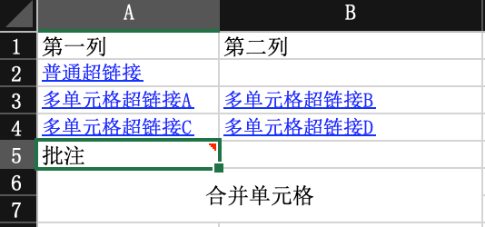

## 示例代码

DEMO代码地址：[https://github.com/alibaba/easyexcel/blob/master/easyexcel-test/src/test/java/com/alibaba/easyexcel/test/demo/read/ReadTest.java](https://github.com/alibaba/easyexcel/blob/master/easyexcel-test/src/test/java/com/alibaba/easyexcel/test/demo/read/ReadTest.java)

## 最简单的读

### 最简单的读的excel示例


### 最简单的读的对象

```java
@Getter
@Setter
@EqualsAndHashCode
public class DemoData {
    private String string;
    private Date date;
    private Double doubleData;
}
```

### 最简单的读的监听器

```java
// 有个很重要的点 DemoDataListener 不能被spring管理，要每次读取excel都要new,然后里面用到spring可以构造方法传进去
@Slf4j
public class DemoDataListener implements ReadListener<DemoData> {

    /**
     * 每隔5条存储数据库，实际使用中可以100条，然后清理list ，方便内存回收
     */
    private static final int BATCH_COUNT = 100;
    /**
     * 缓存的数据
     */
    private List<DemoData> cachedDataList = ListUtils.newArrayListWithExpectedSize(BATCH_COUNT);
    /**
     * 假设这个是一个DAO，当然有业务逻辑这个也可以是一个service。当然如果不用存储这个对象没用。
     */
    private DemoDAO demoDAO;

    public DemoDataListener() {
        // 这里是demo，所以随便new一个。实际使用如果到了spring,请使用下面的有参构造函数
        demoDAO = new DemoDAO();
    }

    /**
     * 如果使用了spring,请使用这个构造方法。每次创建Listener的时候需要把spring管理的类传进来
     *
     * @param demoDAO
     */
    public DemoDataListener(DemoDAO demoDAO) {
        this.demoDAO = demoDAO;
    }

    /**
     * 这个每一条数据解析都会来调用
     *
     * @param data    one row value. Is is same as {@link AnalysisContext#readRowHolder()}
     * @param context
     */
    @Override
    public void invoke(DemoData data, AnalysisContext context) {
        log.info("解析到一条数据:{}", JSON.toJSONString(data));
        cachedDataList.add(data);
        // 达到BATCH_COUNT了，需要去存储一次数据库，防止数据几万条数据在内存，容易OOM
        if (cachedDataList.size() >= BATCH_COUNT) {
            saveData();
            // 存储完成清理 list
            cachedDataList = ListUtils.newArrayListWithExpectedSize(BATCH_COUNT);
        }
    }

    /**
     * 所有数据解析完成了 都会来调用
     *
     * @param context
     */
    @Override
    public void doAfterAllAnalysed(AnalysisContext context) {
        // 这里也要保存数据，确保最后遗留的数据也存储到数据库
        saveData();
        log.info("所有数据解析完成！");
    }

    /**
     * 加上存储数据库
     */
    private void saveData() {
        log.info("{}条数据，开始存储数据库！", cachedDataList.size());
        demoDAO.save(cachedDataList);
        log.info("存储数据库成功！");
    }
}
```

### 持久层

```java
/**
 * 假设这个是你的DAO存储。当然还要这个类让spring管理，当然你不用需要存储，也不需要这个类。
 **/
public class DemoDAO {
    public void save(List<DemoData> list) {
        // 如果是mybatis,尽量别直接调用多次insert,自己写一个mapper里面新增一个方法batchInsert,所有数据一次性插入
    }
}
```

### 代码

```java
    /**
     * 最简单的读
     * <p>
     * 1. 创建excel对应的实体对象 参照{@link DemoData}
     * <p>
     * 2. 由于默认一行行的读取excel，所以需要创建excel一行一行的回调监听器，参照{@link DemoDataListener}
     * <p>
     * 3. 直接读即可
     */
    @Test
    public void simpleRead() {
        // 写法1：JDK8+ ,不用额外写一个DemoDataListener
        // since: 3.0.0-beta1
        String fileName = TestFileUtil.getPath() + "demo" + File.separator + "demo.xlsx";
        // 这里 需要指定读用哪个class去读，然后读取第一个sheet 文件流会自动关闭
        // 这里每次会读取100条数据 然后返回过来 直接调用使用数据就行
        EasyExcel.read(fileName, DemoData.class, new PageReadListener<DemoData>(dataList -> {
            for (DemoData demoData : dataList) {
                log.info("读取到一条数据{}", JSON.toJSONString(demoData));
            }
        })).sheet().doRead();

        // 写法2：
        // 匿名内部类 不用额外写一个DemoDataListener
        fileName = TestFileUtil.getPath() + "demo" + File.separator + "demo.xlsx";
        // 这里 需要指定读用哪个class去读，然后读取第一个sheet 文件流会自动关闭
        EasyExcel.read(fileName, DemoData.class, new ReadListener<DemoData>() {
            /**
             * 单次缓存的数据量
             */
            public static final int BATCH_COUNT = 100;
            /**
             *临时存储
             */
            private List<DemoData> cachedDataList = ListUtils.newArrayListWithExpectedSize(BATCH_COUNT);

            @Override
            public void invoke(DemoData data, AnalysisContext context) {
                cachedDataList.add(data);
                if (cachedDataList.size() >= BATCH_COUNT) {
                    saveData();
                    // 存储完成清理 list
                    cachedDataList = ListUtils.newArrayListWithExpectedSize(BATCH_COUNT);
                }
            }

            @Override
            public void doAfterAllAnalysed(AnalysisContext context) {
                saveData();
            }

            /**
             * 加上存储数据库
             */
            private void saveData() {
                log.info("{}条数据，开始存储数据库！", cachedDataList.size());
                log.info("存储数据库成功！");
            }
        }).sheet().doRead();

        // 有个很重要的点 DemoDataListener 不能被spring管理，要每次读取excel都要new,然后里面用到spring可以构造方法传进去
        // 写法3：
        fileName = TestFileUtil.getPath() + "demo" + File.separator + "demo.xlsx";
        // 这里 需要指定读用哪个class去读，然后读取第一个sheet 文件流会自动关闭
        EasyExcel.read(fileName, DemoData.class, new DemoDataListener()).sheet().doRead();

        // 写法4
        fileName = TestFileUtil.getPath() + "demo" + File.separator + "demo.xlsx";
        // 一个文件一个reader
        try (ExcelReader excelReader = EasyExcel.read(fileName, DemoData.class, new DemoDataListener()).build()) {
            // 构建一个sheet 这里可以指定名字或者no
            ReadSheet readSheet = EasyExcel.readSheet(0).build();
            // 读取一个sheet
            excelReader.read(readSheet);
        }
    }
```

## 指定列的下标或者列名

### excel示例

参照：[最简单的读的excel示例](#最简单的读的excel示例)

### 对象

```java
@Getter
@Setter
@EqualsAndHashCode
public class IndexOrNameData {
    /**
     * 强制读取第三个 这里不建议 index 和 name 同时用，要么一个对象只用index，要么一个对象只用name去匹配
     */
    @ExcelProperty(index = 2)
    private Double doubleData;
    /**
     * 用名字去匹配，这里需要注意，如果名字重复，会导致只有一个字段读取到数据
     */
    @ExcelProperty("字符串标题")
    private String string;
    @ExcelProperty("日期标题")
    private Date date;
}
```

### 监听器

参照：[最简单的读的监听器](#最简单的读的监听器) 只是泛型变了而已

### 代码

```java
    /**
     * 指定列的下标或者列名
     *
     * <p>1. 创建excel对应的实体对象,并使用{@link ExcelProperty}注解. 参照{@link IndexOrNameData}
     * <p>2. 由于默认一行行的读取excel，所以需要创建excel一行一行的回调监听器，参照{@link IndexOrNameDataListener}
     * <p>3. 直接读即可
     */
    @Test
    public void indexOrNameRead() {
        String fileName = TestFileUtil.getPath() + "demo" + File.separator + "demo.xlsx";
        // 这里默认读取第一个sheet
        EasyExcel.read(fileName, IndexOrNameData.class, new IndexOrNameDataListener()).sheet().doRead();
    }
```

## 读多个sheet

### excel示例

参照：[最简单的读的excel示例](#最简单的读的excel示例)

### 对象

参照：[最简单的读的对象](#最简单的读的对象)

### 监听器

参照：[最简单的读的监听器](#最简单的读的监听器)

### 代码

```java
    /**
     * 读多个或者全部sheet,这里注意一个sheet不能读取多次，多次读取需要重新读取文件
     * <p>
     * 1. 创建excel对应的实体对象 参照{@link DemoData}
     * <p>
     * 2. 由于默认一行行的读取excel，所以需要创建excel一行一行的回调监听器，参照{@link DemoDataListener}
     * <p>
     * 3. 直接读即可
     */
    @Test
    public void repeatedRead() {
        String fileName = TestFileUtil.getPath() + "demo" + File.separator + "demo.xlsx";
        // 读取全部sheet
        // 这里需要注意 DemoDataListener的doAfterAllAnalysed 会在每个sheet读取完毕后调用一次。然后所有sheet都会往同一个DemoDataListener里面写
        EasyExcel.read(fileName, DemoData.class, new DemoDataListener()).doReadAll();

        // 读取部分sheet
        fileName = TestFileUtil.getPath() + "demo" + File.separator + "demo.xlsx";

        // 写法1
        try (ExcelReader excelReader = EasyExcel.read(fileName).build()) {
            // 这里为了简单 所以注册了 同样的head 和Listener 自己使用功能必须不同的Listener
            ReadSheet readSheet1 =
                EasyExcel.readSheet(0).head(DemoData.class).registerReadListener(new DemoDataListener()).build();
            ReadSheet readSheet2 =
                EasyExcel.readSheet(1).head(DemoData.class).registerReadListener(new DemoDataListener()).build();
            // 这里注意 一定要把sheet1 sheet2 一起传进去，不然有个问题就是03版的excel 会读取多次，浪费性能
            excelReader.read(readSheet1, readSheet2);
        }
    }
```

## 日期、数字或者自定义格式转换

### excel示例

参照：[最简单的读的excel示例](#最简单的读的excel示例)

### 对象

```java
@Getter
@Setter
@EqualsAndHashCode
public class ConverterData {
    /**
     * 我自定义 转换器，不管数据库传过来什么 。我给他加上“自定义：”
     */
    @ExcelProperty(converter = CustomStringStringConverter.class)
    private String string;
    /**
     * 这里用string 去接日期才能格式化。我想接收年月日格式
     */
    @DateTimeFormat("yyyy年MM月dd日HH时mm分ss秒")
    private String date;
    /**
     * 我想接收百分比的数字
     */
    @NumberFormat("#.##%")
    private String doubleData;
}
```

### 监听器

参照：[最简单的读的监听器](#最简单的读的监听器) 只是泛型变了

### 自定义转换器

```java
public class CustomStringStringConverter implements Converter<String> {
    @Override
    public Class<?> supportJavaTypeKey() {
        return String.class;
    }

    @Override
    public CellDataTypeEnum supportExcelTypeKey() {
        return CellDataTypeEnum.STRING;
    }

    /**
     * 这里读的时候会调用
     *
     * @param context
     * @return
     */
    @Override
    public String convertToJavaData(ReadConverterContext<?> context) {
        return "自定义：" + context.getReadCellData().getStringValue();
    }

    /**
     * 这里是写的时候会调用 不用管
     *
     * @return
     */
    @Override
    public WriteCellData<?> convertToExcelData(WriteConverterContext<String> context) {
        return new WriteCellData<>(context.getValue());
    }

}
```

### 代码

```java
    /**
     * 日期、数字或者自定义格式转换
     * <p>
     * 默认读的转换器{@link DefaultConverterLoader#loadDefaultReadConverter()}
     * <p>1. 创建excel对应的实体对象 参照{@link ConverterData}.里面可以使用注解{@link DateTimeFormat}、{@link NumberFormat}或者自定义注解
     * <p>2. 由于默认一行行的读取excel，所以需要创建excel一行一行的回调监听器，参照{@link ConverterDataListener}
     * <p>3. 直接读即可
     */
    @Test
    public void converterRead() {
        String fileName = TestFileUtil.getPath() + "demo" + File.separator + "demo.xlsx";
        // 这里 需要指定读用哪个class去读，然后读取第一个sheet 
        EasyExcel.read(fileName, ConverterData.class, new ConverterDataListener())
            // 这里注意 我们也可以registerConverter来指定自定义转换器， 但是这个转换变成全局了， 所有java为string,excel为string的都会用这个转换器。
            // 如果就想单个字段使用请使用@ExcelProperty 指定converter
            // .registerConverter(new CustomStringStringConverter())
            // 读取sheet
            .sheet().doRead();
    }
```

## 多行头

### excel示例

参照：[最简单的读的excel示例](#最简单的读的excel示例)

### 对象

参照：[最简单的读的对象](#最简单的读的对象)

### 监听器

参照：[最简单的读的监听器](#最简单的读的监听器)

### 代码

```java
    /**
     * 多行头
     *
     * <p>1. 创建excel对应的实体对象 参照{@link DemoData}
     * <p>2. 由于默认一行行的读取excel，所以需要创建excel一行一行的回调监听器，参照{@link DemoDataListener}
     * <p>3. 设置headRowNumber参数，然后读。 这里要注意headRowNumber如果不指定， 会根据你传入的class的{@link ExcelProperty#value()}里面的表头的数量来决定行数，
     * 如果不传入class则默认为1.当然你指定了headRowNumber不管是否传入class都是以你传入的为准。
     */
    @Test
    public void complexHeaderRead() {
        String fileName = TestFileUtil.getPath() + "demo" + File.separator + "demo.xlsx";
        // 这里 需要指定读用哪个class去读，然后读取第一个sheet 
        EasyExcel.read(fileName, DemoData.class, new DemoDataListener()).sheet()
            // 这里可以设置1，因为头就是一行。如果多行头，可以设置其他值。不传入也可以，因为默认会根据DemoData 来解析，他没有指定头，也就是默认1行
            .headRowNumber(1).doRead();
    }
```

## 同步的返回

### excel示例

参照：[excel示例](#3a393618)

### 对象

参照：[对象](#b1449413)

### 代码

```java
    /**
     * 同步的返回，不推荐使用，如果数据量大会把数据放到内存里面
     */
    @Test
    public void synchronousRead() {
        String fileName = TestFileUtil.getPath() + "demo" + File.separator + "demo.xlsx";
        // 这里 需要指定读用哪个class去读，然后读取第一个sheet 同步读取会自动finish
        List<DemoData> list = EasyExcel.read(fileName).head(DemoData.class).sheet().doReadSync();
        for (DemoData data : list) {
            LOGGER.info("读取到数据:{}", JSON.toJSONString(data));
        }
        // 这里 也可以不指定class，返回一个list，然后读取第一个sheet 同步读取会自动finish
        List<Map<Integer, String>> listMap = EasyExcel.read(fileName).sheet().doReadSync();
        for (Map<Integer, String> data : listMap) {
            // 返回每条数据的键值对 表示所在的列 和所在列的值
            LOGGER.info("读取到数据:{}", JSON.toJSONString(data));
        }
    }
```

## 读取表头数据

### excel示例

参照：[最简单的读的excel示例](#最简单的读的excel示例)

### 对象

参照：[最简单的读的对象](#最简单的读的对象)

### 监听器

参照：[最简单的读的监听器](#最简单的读的监听器)
里面多了一个方法,只要重写invokeHeadMap方法即可

```java
    /**
     * 这里会一行行的返回头
     *
     * @param headMap
     * @param context
     */
    @Override
    public void invokeHead(Map<Integer, ReadCellData<?>> headMap, AnalysisContext context) {
        log.info("解析到一条头数据:{}", JSON.toJSONString(headMap));
        // 如果想转成成 Map<Integer,String>
        // 方案1： 不要implements ReadListener 而是 extends AnalysisEventListener
        // 方案2： 调用 ConverterUtils.convertToStringMap(headMap, context) 自动会转换
    }
```

### 代码

```java
    /**
     * 读取表头数据
     *
     * <p>
     * 1. 创建excel对应的实体对象 参照{@link DemoData}
     * <p>
     * 2. 由于默认一行行的读取excel，所以需要创建excel一行一行的回调监听器，参照{@link DemoHeadDataListener}
     * <p>
     * 3. 直接读即可
     */
    @Test
    public void headerRead() {
        String fileName = TestFileUtil.getPath() + "demo" + File.separator + "demo.xlsx";
        // 这里 需要指定读用哪个class去读，然后读取第一个sheet
        EasyExcel.read(fileName, DemoData.class, new DemoHeadDataListener()).sheet().doRead();
    }
```

## 额外信息（批注、超链接、合并单元格信息读取）

### since

2.0.0-beta1

### excel示例



### 对象

```java
@Getter
@Setter
@EqualsAndHashCode
public class DemoExtraData {

    private String row1;

    private String row2;
}
```

### 监听器

参照：[最简单的读的监听器](#最简单的读的监听器)
里面多了一个 `extra` 方法

```java
@Slf4j
public class DemoExtraListener implements ReadListener<DemoExtraData> {

    @Override
    public void invoke(DemoExtraData data, AnalysisContext context) {}

    @Override
    public void doAfterAllAnalysed(AnalysisContext context) {}

    @Override
    public void extra(CellExtra extra, AnalysisContext context) {
        log.info("读取到了一条额外信息:{}", JSON.toJSONString(extra));
        switch (extra.getType()) {
            case COMMENT:
                log.info("额外信息是批注,在rowIndex:{},columnIndex;{},内容是:{}", extra.getRowIndex(), extra.getColumnIndex(),
                    extra.getText());
                break;
            case HYPERLINK:
                if ("Sheet1!A1".equals(extra.getText())) {
                    log.info("额外信息是超链接,在rowIndex:{},columnIndex;{},内容是:{}", extra.getRowIndex(),
                        extra.getColumnIndex(), extra.getText());
                } else if ("Sheet2!A1".equals(extra.getText())) {
                    log.info(
                        "额外信息是超链接,而且覆盖了一个区间,在firstRowIndex:{},firstColumnIndex;{},lastRowIndex:{},lastColumnIndex:{},"
                            + "内容是:{}",
                        extra.getFirstRowIndex(), extra.getFirstColumnIndex(), extra.getLastRowIndex(),
                        extra.getLastColumnIndex(), extra.getText());
                } else {
                    Assert.fail("Unknown hyperlink!");
                }
                break;
            case MERGE:
                log.info(
                    "额外信息是超链接,而且覆盖了一个区间,在firstRowIndex:{},firstColumnIndex;{},lastRowIndex:{},lastColumnIndex:{}",
                    extra.getFirstRowIndex(), extra.getFirstColumnIndex(), extra.getLastRowIndex(),
                    extra.getLastColumnIndex());
                break;
            default:
        }
    }
}
```

### 代码

```java
    /**
     * 额外信息（批注、超链接、合并单元格信息读取）
     * <p>
     * 由于是流式读取，没法在读取到单元格数据的时候直接读取到额外信息，所以只能最后通知哪些单元格有哪些额外信息
     *
     * <p>
     * 1. 创建excel对应的实体对象 参照{@link DemoExtraData}
     * <p>
     * 2. 由于默认异步读取excel，所以需要创建excel一行一行的回调监听器，参照{@link DemoExtraListener}
     * <p>
     * 3. 直接读即可
     *
     * @since 2.2.0-beat1
     */
    @Test
    public void extraRead() {
        String fileName = TestFileUtil.getPath() + "demo" + File.separator + "extra.xlsx";
        // 这里 需要指定读用哪个class去读，然后读取第一个sheet
        EasyExcel.read(fileName, DemoExtraData.class, new DemoExtraListener())
            // 需要读取批注 默认不读取
            .extraRead(CellExtraTypeEnum.COMMENT)
            // 需要读取超链接 默认不读取
            .extraRead(CellExtraTypeEnum.HYPERLINK)
            // 需要读取合并单元格信息 默认不读取
            .extraRead(CellExtraTypeEnum.MERGE).sheet().doRead();
    }
```

## 读取公式和单元格类型

### excel示例


### 对象

```java
@Getter
@Setter
@EqualsAndHashCode
public class CellDataReadDemoData {
    private CellData<String> string;
    // 这里注意 虽然是日期 但是 类型 存储的是number 因为excel 存储的就是number
    private CellData<Date> date;
    private CellData<Double> doubleData;
    // 这里并不一定能完美的获取 有些公式是依赖性的 可能会读不到 这个问题后续会修复
    private CellData<String> formulaValue;
}
```

### 监听器

参照：[最简单的读的监听器](#最简单的读的监听器)
代码

```java
       /**
     * 读取公式和单元格类型
     *
     * <p>
     * 1. 创建excel对应的实体对象 参照{@link CellDataReadDemoData}
     * <p>
     * 2. 由于默认一行行的读取excel，所以需要创建excel一行一行的回调监听器，参照{@link DemoHeadDataListener}
     * <p>
     * 3. 直接读即可
     *
     * @since 2.2.0-beat1
     */
    @Test
    public void cellDataRead() {
        String fileName = TestFileUtil.getPath() + "demo" + File.separator + "cellDataDemo.xlsx";
        // 这里 需要指定读用哪个class去读，然后读取第一个sheet
        EasyExcel.read(fileName, CellDataReadDemoData.class, new CellDataDemoHeadDataListener()).sheet().doRead();
    }
```

## 数据转换等异常处理

### excel示例

参照：[最简单的读的excel示例](#最简单的读的excel示例)

### 对象

```java
@Getter
@Setter
@EqualsAndHashCode
public class ExceptionDemoData {
    /**
     * 用日期去接字符串 肯定报错
     */
    private Date date;
}

```

### 监听器

参照：[最简单的读的监听器](#最简单的读的监听器)
里面多了一个方法,只要重写onException方法即可

```java
    /**
     * 在转换异常 获取其他异常下会调用本接口。抛出异常则停止读取。如果这里不抛出异常则 继续读取下一行。
     *
     * @param exception
     * @param context
     * @throws Exception
     */
    @Override
    public void onException(Exception exception, AnalysisContext context) {
        log.error("解析失败，但是继续解析下一行:{}", exception.getMessage());
        // 如果是某一个单元格的转换异常 能获取到具体行号
        // 如果要获取头的信息 配合invokeHeadMap使用
        if (exception instanceof ExcelDataConvertException) {
            ExcelDataConvertException excelDataConvertException = (ExcelDataConvertException)exception;
            log.error("第{}行，第{}列解析异常，数据为:{}", excelDataConvertException.getRowIndex(),
                excelDataConvertException.getColumnIndex(), excelDataConvertException.getCellData());
        }
    }
```

### 代码

```java
    /**
     * 数据转换等异常处理
     *
     * <p>
     * 1. 创建excel对应的实体对象 参照{@link ExceptionDemoData}
     * <p>
     * 2. 由于默认一行行的读取excel，所以需要创建excel一行一行的回调监听器，参照{@link DemoExceptionListener}
     * <p>
     * 3. 直接读即可
     */
    @Test
    public void exceptionRead() {
        String fileName = TestFileUtil.getPath() + "demo" + File.separator + "demo.xlsx";
        // 这里 需要指定读用哪个class去读，然后读取第一个sheet
        EasyExcel.read(fileName, ExceptionDemoData.class, new DemoExceptionListener()).sheet().doRead();
    }
```

## 不创建对象的读

### excel示例

参照：[最简单的读的excel示例](#最简单的读的excel示例)

### 监听器

```java
@Slf4j
public class NoModelDataListener extends AnalysisEventListener<Map<Integer, String>> {
    /**
     * 每隔5条存储数据库，实际使用中可以100条，然后清理list ，方便内存回收
     */
    private static final int BATCH_COUNT = 5;
    private List<Map<Integer, String>> cachedDataList = ListUtils.newArrayListWithExpectedSize(BATCH_COUNT);

    @Override
    public void invoke(Map<Integer, String> data, AnalysisContext context) {
        log.info("解析到一条数据:{}", JSON.toJSONString(data));
        cachedDataList.add(data);
        if (cachedDataList.size() >= BATCH_COUNT) {
            saveData();
            cachedDataList = ListUtils.newArrayListWithExpectedSize(BATCH_COUNT);
        }
    }

    @Override
    public void doAfterAllAnalysed(AnalysisContext context) {
        saveData();
        log.info("所有数据解析完成！");
    }

    /**
     * 加上存储数据库
     */
    private void saveData() {
        log.info("{}条数据，开始存储数据库！", cachedDataList.size());
        log.info("存储数据库成功！");
    }
}

```

### 代码

```java
    /**
     * 不创建对象的读
     */
    @Test
    public void noModelRead() {
        String fileName = TestFileUtil.getPath() + "demo" + File.separator + "demo.xlsx";
        // 这里 只要，然后读取第一个sheet 同步读取会自动finish
        EasyExcel.read(fileName, new NoModelDataListener()).sheet().doRead();
    }
```

## web中的读

### 示例代码

DEMO代码地址：[https://github.com/alibaba/easyexcel/blob/master/easyexcel-test/src/test/java/com/alibaba/easyexcel/test/demo/web/WebTest.java](https://github.com/alibaba/easyexcel/blob/master/easyexcel-test/src/test/java/com/alibaba/easyexcel/test/demo/web/WebTest.java)

### excel示例

参照：[最简单的读的excel示例](#最简单的读的excel示例)

### 对象

参照：[最简单的读的对象](#最简单的读的对象) 只是名字变了

### 监听器

参照：[最简单的读的监听器](#最简单的读的监听器) 只是泛型变了

### 代码

```java
    /**
     * 文件上传
     * <p>
     * 1. 创建excel对应的实体对象 参照{@link UploadData}
     * <p>
     * 2. 由于默认一行行的读取excel，所以需要创建excel一行一行的回调监听器，参照{@link UploadDataListener}
     * <p>
     * 3. 直接读即可
     */
    @PostMapping("upload")
    @ResponseBody
    public String upload(MultipartFile file) throws IOException {
        EasyExcel.read(file.getInputStream(), UploadData.class, new UploadDataListener(uploadDAO)).sheet().doRead();
        return "success";
    }
```


