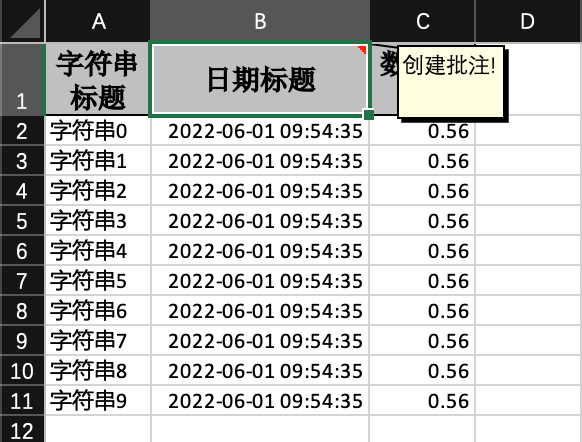

### 通用数据生成 后面不会重复写

```java
    private List<DemoData> data() {
        List<DemoData> list = ListUtils.newArrayList();
        for (int i = 0; i < 10; i++) {
            DemoData data = new DemoData();
            data.setString("字符串" + i);
            data.setDate(new Date());
            data.setDoubleData(0.56);
            list.add(data);
        }
        return list;
    }
```

## 示例代码

DEMO代码地址：[https://github.com/alibaba/easyexcel/blob/master/easyexcel-test/src/test/java/com/alibaba/easyexcel/test/demo/write/WriteTest.java](https://github.com/alibaba/easyexcel/blob/master/easyexcel-test/src/test/java/com/alibaba/easyexcel/test/demo/write/WriteTest.java)

## 最简单的写

### excel示例


### 最简单的写的对象

```java
@Getter
@Setter
@EqualsAndHashCode
public class DemoData {
    @ExcelProperty("字符串标题")
    private String string;
    @ExcelProperty("日期标题")
    private Date date;
    @ExcelProperty("数字标题")
    private Double doubleData;
    /**
     * 忽略这个字段
     */
    @ExcelIgnore
    private String ignore;
}
```

### 代码

```java
    /**
     * 最简单的写
     * <p>
     * 1. 创建excel对应的实体对象 参照{@link DemoData}
     * <p>
     * 2. 直接写即可
     */
    @Test
    public void simpleWrite() {
        // 注意 simpleWrite在数据量不大的情况下可以使用（5000以内，具体也要看实际情况），数据量大参照 重复多次写入

        // 写法1 JDK8+
        // since: 3.0.0-beta1
        String fileName = TestFileUtil.getPath() + "simpleWrite" + System.currentTimeMillis() + ".xlsx";
        // 这里 需要指定写用哪个class去写，然后写到第一个sheet，名字为模板 然后文件流会自动关闭
        // 如果这里想使用03 则 传入excelType参数即可
        EasyExcel.write(fileName, DemoData.class)
            .sheet("模板")
            .doWrite(() -> {
                // 分页查询数据
                return data();
            });

        // 写法2
        fileName = TestFileUtil.getPath() + "simpleWrite" + System.currentTimeMillis() + ".xlsx";
        // 这里 需要指定写用哪个class去写，然后写到第一个sheet，名字为模板 然后文件流会自动关闭
        // 如果这里想使用03 则 传入excelType参数即可
        EasyExcel.write(fileName, DemoData.class).sheet("模板").doWrite(data());

        // 写法3
        fileName = TestFileUtil.getPath() + "simpleWrite" + System.currentTimeMillis() + ".xlsx";
        // 这里 需要指定写用哪个class去写
        try (ExcelWriter excelWriter = EasyExcel.write(fileName, DemoData.class).build()) {
            WriteSheet writeSheet = EasyExcel.writerSheet("模板").build();
            excelWriter.write(data(), writeSheet);
        }
    }
```

## 根据参数只导出指定列

### excel示例


### 对象

参照：[最简单的写的对象](#最简单的写的对象)

### 代码

```java
    /**
     * 根据参数只导出指定列
     * <p>
     * 1. 创建excel对应的实体对象 参照{@link DemoData}
     * <p>
     * 2. 根据自己或者排除自己需要的列
     * <p>
     * 3. 直接写即可
     *
     * @since 2.1.1
     */
    @Test
    public void excludeOrIncludeWrite() {
        String fileName = TestFileUtil.getPath() + "excludeOrIncludeWrite" + System.currentTimeMillis() + ".xlsx";
        // 这里需要注意 在使用ExcelProperty注解的使用，如果想不空列则需要加入order字段，而不是index,order会忽略空列，然后继续往后，而index，不会忽略空列，在第几列就是第几列。

        // 根据用户传入字段 假设我们要忽略 date
        Set<String> excludeColumnFiledNames = new HashSet<String>();
        excludeColumnFiledNames.add("date");
        // 这里 需要指定写用哪个class去写，然后写到第一个sheet，名字为模板 然后文件流会自动关闭
        EasyExcel.write(fileName, DemoData.class).excludeColumnFiledNames(excludeColumnFiledNames).sheet("模板")
            .doWrite(data());

        fileName = TestFileUtil.getPath() + "excludeOrIncludeWrite" + System.currentTimeMillis() + ".xlsx";
        // 根据用户传入字段 假设我们只要导出 date
        Set<String> includeColumnFiledNames = new HashSet<String>();
        includeColumnFiledNames.add("date");
        // 这里 需要指定写用哪个class去写，然后写到第一个sheet，名字为模板 然后文件流会自动关闭
        EasyExcel.write(fileName, DemoData.class).includeColumnFiledNames(includeColumnFiledNames).sheet("模板")
            .doWrite(data());
    }
```

## 指定写入的列

### excel示例


### 对象

```java
@Getter
@Setter
@EqualsAndHashCode
public class IndexData {
    @ExcelProperty(value = "字符串标题", index = 0)
    private String string;
    @ExcelProperty(value = "日期标题", index = 1)
    private Date date;
    /**
     * 这里设置3 会导致第二列空的
     */
    @ExcelProperty(value = "数字标题", index = 3)
    private Double doubleData;
}
```

### 代码

```java
    /**
     * 指定写入的列
     * <p>1. 创建excel对应的实体对象 参照{@link IndexData}
     * <p>2. 使用{@link ExcelProperty}注解指定写入的列
     * <p>3. 直接写即可
     */
    @Test
    public void indexWrite() {
        String fileName = TestFileUtil.getPath() + "indexWrite" + System.currentTimeMillis() + ".xlsx";
        // 这里 需要指定写用哪个class去写，然后写到第一个sheet，名字为模板 然后文件流会自动关闭
        EasyExcel.write(fileName, IndexData.class).sheet("模板").doWrite(data());
    }
```

## 复杂头写入

### excel示例


### 对象

```java
@Getter
@Setter
@EqualsAndHashCode
public class ComplexHeadData {
    @ExcelProperty({"主标题", "字符串标题"})
    private String string;
    @ExcelProperty({"主标题", "日期标题"})
    private Date date;
    @ExcelProperty({"主标题", "数字标题"})
    private Double doubleData;
}
```

### 代码

```java
    /**
     * 复杂头写入
     * <p>1. 创建excel对应的实体对象 参照{@link ComplexHeadData}
     * <p>2. 使用{@link ExcelProperty}注解指定复杂的头
     * <p>3. 直接写即可
     */
    @Test
    public void complexHeadWrite() {
        String fileName = TestFileUtil.getPath() + "complexHeadWrite" + System.currentTimeMillis() + ".xlsx";
        // 这里 需要指定写用哪个class去写，然后写到第一个sheet，名字为模板 然后文件流会自动关闭
        EasyExcel.write(fileName, ComplexHeadData.class).sheet("模板").doWrite(data());
    }
```

## 重复多次写入(写到单个或者多个Sheet)

### excel示例


### 对象

参照：[最简单的写的对象](#最简单的写的对象)

### 代码

```java
    /**
     * 重复多次写入
     * <p>
     * 1. 创建excel对应的实体对象 参照{@link ComplexHeadData}
     * <p>
     * 2. 使用{@link ExcelProperty}注解指定复杂的头
     * <p>
     * 3. 直接调用二次写入即可
     */
    @Test
    public void repeatedWrite() {
        // 方法1: 如果写到同一个sheet
        String fileName = TestFileUtil.getPath() + "repeatedWrite" + System.currentTimeMillis() + ".xlsx";
        // 这里 需要指定写用哪个class去写
        try (ExcelWriter excelWriter = EasyExcel.write(fileName, DemoData.class).build()) {
            // 这里注意 如果同一个sheet只要创建一次
            WriteSheet writeSheet = EasyExcel.writerSheet("模板").build();
            // 去调用写入,这里我调用了五次，实际使用时根据数据库分页的总的页数来
            for (int i = 0; i < 5; i++) {
                // 分页去数据库查询数据 这里可以去数据库查询每一页的数据
                List<DemoData> data = data();
                excelWriter.write(data, writeSheet);
            }
        }

        // 方法2: 如果写到不同的sheet 同一个对象
        fileName = TestFileUtil.getPath() + "repeatedWrite" + System.currentTimeMillis() + ".xlsx";
        // 这里 指定文件
        try (ExcelWriter excelWriter = EasyExcel.write(fileName, DemoData.class).build()) {
            // 去调用写入,这里我调用了五次，实际使用时根据数据库分页的总的页数来。这里最终会写到5个sheet里面
            for (int i = 0; i < 5; i++) {
                // 每次都要创建writeSheet 这里注意必须指定sheetNo 而且sheetName必须不一样
                WriteSheet writeSheet = EasyExcel.writerSheet(i, "模板" + i).build();
                // 分页去数据库查询数据 这里可以去数据库查询每一页的数据
                List<DemoData> data = data();
                excelWriter.write(data, writeSheet);
            }
        }

        // 方法3 如果写到不同的sheet 不同的对象
        fileName = TestFileUtil.getPath() + "repeatedWrite" + System.currentTimeMillis() + ".xlsx";
        // 这里 指定文件
        try (ExcelWriter excelWriter = EasyExcel.write(fileName).build()) {
            // 去调用写入,这里我调用了五次，实际使用时根据数据库分页的总的页数来。这里最终会写到5个sheet里面
            for (int i = 0; i < 5; i++) {
                // 每次都要创建writeSheet 这里注意必须指定sheetNo 而且sheetName必须不一样。这里注意DemoData.class 可以每次都变，我这里为了方便 所以用的同一个class
                // 实际上可以一直变
                WriteSheet writeSheet = EasyExcel.writerSheet(i, "模板" + i).head(DemoData.class).build();
                // 分页去数据库查询数据 这里可以去数据库查询每一页的数据
                List<DemoData> data = data();
                excelWriter.write(data, writeSheet);
            }
        }

    }
```

## 日期、数字或者自定义格式转换

### excel示例


### 对象

```java
@Getter
@Setter
@EqualsAndHashCode
public class ConverterData {
    /**
     * 我想所有的 字符串起前面加上"自定义："三个字
     */
    @ExcelProperty(value = "字符串标题", converter = CustomStringStringConverter.class)
    private String string;
    /**
     * 我想写到excel 用年月日的格式
     */
    @DateTimeFormat("yyyy年MM月dd日HH时mm分ss秒")
    @ExcelProperty("日期标题")
    private Date date;
    /**
     * 我想写到excel 用百分比表示
     */
    @NumberFormat("#.##%")
    @ExcelProperty(value = "数字标题")
    private Double doubleData;
}
```

### 代码

```java
    /**
     * 日期、数字或者自定义格式转换
     * <p>1. 创建excel对应的实体对象 参照{@link ConverterData}
     * <p>2. 使用{@link ExcelProperty}配合使用注解{@link DateTimeFormat}、{@link NumberFormat}或者自定义注解
     * <p>3. 直接写即可
     */
    @Test
    public void converterWrite() {
        String fileName = TestFileUtil.getPath() + "converterWrite" + System.currentTimeMillis() + ".xlsx";
        // 这里 需要指定写用哪个class去写，然后写到第一个sheet，名字为模板 然后文件流会自动关闭
        EasyExcel.write(fileName, ConverterData.class).sheet("模板").doWrite(data());
    }
```

## 图片导出

### excel示例


### 对象

```java
@Getter
@Setter
@EqualsAndHashCode
@ContentRowHeight(100)
@ColumnWidth(100 / 8)
public class ImageDemoData {
    private File file;
    private InputStream inputStream;
    /**
     * 如果string类型 必须指定转换器，string默认转换成string
     */
    @ExcelProperty(converter = StringImageConverter.class)
    private String string;
    private byte[] byteArray;
    /**
     * 根据url导出
     *
     * @since 2.1.1
     */
    private URL url;

    /**
     * 根据文件导出 并设置导出的位置。
     *
     * @since 3.0.0-beta1
     */
    private WriteCellData<Void> writeCellDataFile;
}
```

### 代码

```java
   /**
     * 图片导出
     * <p>
     * 1. 创建excel对应的实体对象 参照{@link ImageDemoData}
     * <p>
     * 2. 直接写即可
     */
    @Test
    public void imageWrite() throws Exception {
        String fileName = TestFileUtil.getPath() + "imageWrite" + System.currentTimeMillis() + ".xlsx";

        // 这里注意下 所有的图片都会放到内存 暂时没有很好的解法，大量图片的情况下建议 2选1:
        // 1. 将图片上传到oss 或者其他存储网站: https://www.aliyun.com/product/oss ，然后直接放链接
        // 2. 使用: https://github.com/coobird/thumbnailator 或者其他工具压缩图片
        
        String imagePath = TestFileUtil.getPath() + "converter" + File.separator + "img.jpg";
        try (InputStream inputStream = FileUtils.openInputStream(new File(imagePath))) {
            List<ImageDemoData> list =  ListUtils.newArrayList();
            ImageDemoData imageDemoData = new ImageDemoData();
            list.add(imageDemoData);
            // 放入五种类型的图片 实际使用只要选一种即可
            imageDemoData.setByteArray(FileUtils.readFileToByteArray(new File(imagePath)));
            imageDemoData.setFile(new File(imagePath));
            imageDemoData.setString(imagePath);
            imageDemoData.setInputStream(inputStream);
            imageDemoData.setUrl(new URL(
                "https://raw.githubusercontent.com/alibaba/easyexcel/master/src/test/resources/converter/img.jpg"));

            // 这里演示
            // 需要额外放入文字
            // 而且需要放入2个图片
            // 第一个图片靠左
            // 第二个靠右 而且要额外的占用他后面的单元格
            WriteCellData<Void> writeCellData = new WriteCellData<>();
            imageDemoData.setWriteCellDataFile(writeCellData);
            // 这里可以设置为 EMPTY 则代表不需要其他数据了
            writeCellData.setType(CellDataTypeEnum.STRING);
            writeCellData.setStringValue("额外的放一些文字");

            // 可以放入多个图片
            List<ImageData> imageDataList = new ArrayList<>();
            ImageData imageData = new ImageData();
            imageDataList.add(imageData);
            writeCellData.setImageDataList(imageDataList);
            // 放入2进制图片
            imageData.setImage(FileUtils.readFileToByteArray(new File(imagePath)));
            // 图片类型
            imageData.setImageType(ImageType.PICTURE_TYPE_PNG);
            // 上 右 下 左 需要留空
            // 这个类似于 css 的 margin
            // 这里实测 不能设置太大 超过单元格原始大小后 打开会提示修复。暂时未找到很好的解法。
            imageData.setTop(5);
            imageData.setRight(40);
            imageData.setBottom(5);
            imageData.setLeft(5);

            // 放入第二个图片
            imageData = new ImageData();
            imageDataList.add(imageData);
            writeCellData.setImageDataList(imageDataList);
            imageData.setImage(FileUtils.readFileToByteArray(new File(imagePath)));
            imageData.setImageType(ImageType.PICTURE_TYPE_PNG);
            imageData.setTop(5);
            imageData.setRight(5);
            imageData.setBottom(5);
            imageData.setLeft(50);
            // 设置图片的位置 假设 现在目标 是 覆盖 当前单元格 和当前单元格右边的单元格
            // 起点相对于当前单元格为0 当然可以不写
            imageData.setRelativeFirstRowIndex(0);
            imageData.setRelativeFirstColumnIndex(0);
            imageData.setRelativeLastRowIndex(0);
            // 前面3个可以不写  下面这个需要写 也就是 结尾 需要相对当前单元格 往右移动一格
            // 也就是说 这个图片会覆盖当前单元格和 后面的那一格
            imageData.setRelativeLastColumnIndex(1);

            // 写入数据
            EasyExcel.write(fileName, ImageDemoData.class).sheet().doWrite(list);
        }
    }
```

## 超链接、备注、公式、指定单个单元格的样式、单个单元格多种样式

### excel示例


### 对象

```java
@Getter
@Setter
@EqualsAndHashCode
public class WriteCellDemoData {
    /**
     * 超链接
     *
     * @since 3.0.0-beta1
     */
    private WriteCellData<String> hyperlink;

    /**
     * 备注
     *
     * @since 3.0.0-beta1
     */
    private WriteCellData<String> commentData;

    /**
     * 公式
     *
     * @since 3.0.0-beta1
     */
    private WriteCellData<String> formulaData;

    /**
     * 指定单元格的样式。当然样式 也可以用注解等方式。
     *
     * @since 3.0.0-beta1
     */
    private WriteCellData<String> writeCellStyle;

    /**
     * 指定一个单元格有多个样式
     *
     * @since 3.0.0-beta1
     */
    private WriteCellData<String> richText;
}
```

### 代码

```java
    /**
     * 超链接、备注、公式、指定单个单元格的样式、单个单元格多种样式
     * <p>
     * 1. 创建excel对应的实体对象 参照{@link WriteCellDemoData}
     * <p>
     * 2. 直接写即可
     *
     * @since 3.0.0-beta1
     */
    @Test
    public void writeCellDataWrite() {
        String fileName = TestFileUtil.getPath() + "writeCellDataWrite" + System.currentTimeMillis() + ".xlsx";
        WriteCellDemoData writeCellDemoData = new WriteCellDemoData();

        // 设置超链接
        WriteCellData<String> hyperlink = new WriteCellData<>("官方网站");
        writeCellDemoData.setHyperlink(hyperlink);
        HyperlinkData hyperlinkData = new HyperlinkData();
        hyperlink.setHyperlinkData(hyperlinkData);
        hyperlinkData.setAddress("https://github.com/alibaba/easyexcel");
        hyperlinkData.setHyperlinkType(HyperlinkType.URL);

        // 设置备注
        WriteCellData<String> comment = new WriteCellData<>("备注的单元格信息");
        writeCellDemoData.setCommentData(comment);
        CommentData commentData = new CommentData();
        comment.setCommentData(commentData);
        commentData.setAuthor("Jiaju Zhuang");
        commentData.setRichTextStringData(new RichTextStringData("这是一个备注"));
        // 备注的默认大小是按照单元格的大小 这里想调整到4个单元格那么大 所以向后 向下 各额外占用了一个单元格
        commentData.setRelativeLastColumnIndex(1);
        commentData.setRelativeLastRowIndex(1);

        // 设置公式
        WriteCellData<String> formula = new WriteCellData<>();
        writeCellDemoData.setFormulaData(formula);
        FormulaData formulaData = new FormulaData();
        formula.setFormulaData(formulaData);
        // 将 123456789 中的第一个数字替换成 2
        // 这里只是例子 如果真的涉及到公式 能内存算好尽量内存算好 公式能不用尽量不用
        formulaData.setFormulaValue("REPLACE(123456789,1,1,2)");

        // 设置单个单元格的样式 当然样式 很多的话 也可以用注解等方式。
        WriteCellData<String> writeCellStyle = new WriteCellData<>("单元格样式");
        writeCellStyle.setType(CellDataTypeEnum.STRING);
        writeCellDemoData.setWriteCellStyle(writeCellStyle);
        WriteCellStyle writeCellStyleData = new WriteCellStyle();
        writeCellStyle.setWriteCellStyle(writeCellStyleData);
        // 这里需要指定 FillPatternType 为FillPatternType.SOLID_FOREGROUND 不然无法显示背景颜色.
        writeCellStyleData.setFillPatternType(FillPatternType.SOLID_FOREGROUND);
        // 背景绿色
        writeCellStyleData.setFillForegroundColor(IndexedColors.GREEN.getIndex());

        // 设置单个单元格多种样式
        // 这里需要设置 inMomery=true 不然会导致无法展示单个单元格多种样式，所以慎用
        WriteCellData<String> richTest = new WriteCellData<>();
        richTest.setType(CellDataTypeEnum.RICH_TEXT_STRING);
        writeCellDemoData.setRichText(richTest);
        RichTextStringData richTextStringData = new RichTextStringData();
        richTest.setRichTextStringDataValue(richTextStringData);
        richTextStringData.setTextString("红色绿色默认");
        // 前2个字红色
        WriteFont writeFont = new WriteFont();
        writeFont.setColor(IndexedColors.RED.getIndex());
        richTextStringData.applyFont(0, 2, writeFont);
        // 接下来2个字绿色
        writeFont = new WriteFont();
        writeFont.setColor(IndexedColors.GREEN.getIndex());
        richTextStringData.applyFont(2, 4, writeFont);

        List<WriteCellDemoData> data = new ArrayList<>();
        data.add(writeCellDemoData);
        EasyExcel.write(fileName, WriteCellDemoData.class).inMemory(true).sheet("模板").doWrite(data);
    }
```

## 根据模板写入

### 模板excel示例


### excel示例


### 对象

参照：[最简单的写的对象](#最简单的写的对象)

### 代码

```java
    /**
     * 根据模板写入
     * <p>1. 创建excel对应的实体对象 参照{@link IndexData}
     * <p>2. 使用{@link ExcelProperty}注解指定写入的列
     * <p>3. 使用withTemplate 写取模板
     * <p>4. 直接写即可
     */
    @Test
    public void templateWrite() {
        String templateFileName = TestFileUtil.getPath() + "demo" + File.separator + "demo.xlsx";
        String fileName = TestFileUtil.getPath() + "templateWrite" + System.currentTimeMillis() + ".xlsx";
        // 这里 需要指定写用哪个class去写，然后写到第一个sheet，名字为模板 然后文件流会自动关闭
        // 这里要注意 withTemplate 的模板文件会全量存储在内存里面，所以尽量不要用于追加文件，如果文件模板文件过大会OOM
        // 如果要再文件中追加（无法在一个线程里面处理，可以在一个线程的建议参照多次写入的demo） 建议临时存储到数据库 或者 磁盘缓存(ehcache) 然后再一次性写入
        EasyExcel.write(fileName, DemoData.class).withTemplate(templateFileName).sheet().doWrite(data());
    }
```

## 列宽、行高

### excel示例


### 对象

```java
@Getter
@Setter
@EqualsAndHashCode
@ContentRowHeight(10)
@HeadRowHeight(20)
@ColumnWidth(25)
public class WidthAndHeightData {
    @ExcelProperty("字符串标题")
    private String string;
    @ExcelProperty("日期标题")
    private Date date;
    /**
     * 宽度为50
     */
    @ColumnWidth(50)
    @ExcelProperty("数字标题")
    private Double doubleData;
}
```

### 代码

```java
    /**
     * 列宽、行高
     * <p>1. 创建excel对应的实体对象 参照{@link WidthAndHeightData}
     * <p>2. 使用注解{@link ColumnWidth}、{@link HeadRowHeight}、{@link ContentRowHeight}指定宽度或高度
     * <p>3. 直接写即可
     */
    @Test
    public void widthAndHeightWrite() {
        String fileName = TestFileUtil.getPath() + "widthAndHeightWrite" + System.currentTimeMillis() + ".xlsx";
        // 这里 需要指定写用哪个class去写，然后写到第一个sheet，名字为模板 然后文件流会自动关闭
        EasyExcel.write(fileName, WidthAndHeightData.class).sheet("模板").doWrite(data());
    }
```

## 注解形式自定义样式

### since

2.2.0-beta1

### excel示例


### 对象

```java
@Getter
@Setter
@EqualsAndHashCode
// 头背景设置成红色 IndexedColors.RED.getIndex()
@HeadStyle(fillPatternType = FillPatternTypeEnum.SOLID_FOREGROUND, fillForegroundColor = 10)
// 头字体设置成20
@HeadFontStyle(fontHeightInPoints = 20)
// 内容的背景设置成绿色 IndexedColors.GREEN.getIndex()
@ContentStyle(fillPatternType = FillPatternTypeEnum.SOLID_FOREGROUND, fillForegroundColor = 17)
// 内容字体设置成20
@ContentFontStyle(fontHeightInPoints = 20)
public class DemoStyleData {
    // 字符串的头背景设置成粉红 IndexedColors.PINK.getIndex()
    @HeadStyle(fillPatternType = FillPatternTypeEnum.SOLID_FOREGROUND, fillForegroundColor = 14)
    // 字符串的头字体设置成20
    @HeadFontStyle(fontHeightInPoints = 30)
    // 字符串的内容的背景设置成天蓝 IndexedColors.SKY_BLUE.getIndex()
    @ContentStyle(fillPatternType = FillPatternTypeEnum.SOLID_FOREGROUND, fillForegroundColor = 40)
    // 字符串的内容字体设置成20
    @ContentFontStyle(fontHeightInPoints = 30)
    @ExcelProperty("字符串标题")
    private String string;
    @ExcelProperty("日期标题")
    private Date date;
    @ExcelProperty("数字标题")
    private Double doubleData;
}/**
 * 样式的数据类
 *
 * @author Jiaju Zhuang
 **/
@Data
// 头背景设置成红色 IndexedColors.RED.getIndex()
@HeadStyle(fillPatternType = FillPatternType.SOLID_FOREGROUND, fillForegroundColor = 10)
// 头字体设置成20
@HeadFontStyle(fontHeightInPoints = 20)
// 内容的背景设置成绿色 IndexedColors.GREEN.getIndex()
@ContentStyle(fillPatternType = FillPatternType.SOLID_FOREGROUND, fillForegroundColor = 17)
// 内容字体设置成20
@ContentFontStyle(fontHeightInPoints = 20)
public class DemoStyleData {
    // 字符串的头背景设置成粉红 IndexedColors.PINK.getIndex()
    @HeadStyle(fillPatternType = FillPatternType.SOLID_FOREGROUND, fillForegroundColor = 14)
    // 字符串的头字体设置成20
    @HeadFontStyle(fontHeightInPoints = 30)
    // 字符串的内容的背景设置成天蓝 IndexedColors.SKY_BLUE.getIndex()
    @ContentStyle(fillPatternType = FillPatternType.SOLID_FOREGROUND, fillForegroundColor = 40)
    // 字符串的内容字体设置成20
    @ContentFontStyle(fontHeightInPoints = 30)
    @ExcelProperty("字符串标题")
    private String string;
    @ExcelProperty("日期标题")
    private Date date;
    @ExcelProperty("数字标题")
    private Double doubleData;
}
```

### 代码

```java
    /**
     * 注解形式自定义样式
     * <p>
     * 1. 创建excel对应的实体对象 参照{@link DemoStyleData}
     * <p>
     * 3. 直接写即可
     *
     * @since 2.2.0-beta1
     */
    @Test
    public void annotationStyleWrite() {
        String fileName = TestFileUtil.getPath() + "annotationStyleWrite" + System.currentTimeMillis() + ".xlsx";
        // 这里 需要指定写用哪个class去写，然后写到第一个sheet，名字为模板 然后文件流会自动关闭
        EasyExcel.write(fileName, DemoStyleData.class).sheet("模板").doWrite(data());
    }
```

## 自定义样式

### excel示例


### 对象

参照：[最简单的写的对象](#最简单的写的对象)

### 代码

```java
    /**
     * 拦截器形式自定义样式
     * <p>
     * 1. 创建excel对应的实体对象 参照{@link DemoData}
     * <p>
     * 2. 创建一个style策略 并注册
     * <p>
     * 3. 直接写即可
     */
    @Test
    public void handlerStyleWrite() {
        // 方法1 使用已有的策略 推荐
        // HorizontalCellStyleStrategy 每一行的样式都一样 或者隔行一样
        // AbstractVerticalCellStyleStrategy 每一列的样式都一样 需要自己回调每一页
        String fileName = TestFileUtil.getPath() + "handlerStyleWrite" + System.currentTimeMillis() + ".xlsx";
        // 头的策略
        WriteCellStyle headWriteCellStyle = new WriteCellStyle();
        // 背景设置为红色
        headWriteCellStyle.setFillForegroundColor(IndexedColors.RED.getIndex());
        WriteFont headWriteFont = new WriteFont();
        headWriteFont.setFontHeightInPoints((short)20);
        headWriteCellStyle.setWriteFont(headWriteFont);
        // 内容的策略
        WriteCellStyle contentWriteCellStyle = new WriteCellStyle();
        // 这里需要指定 FillPatternType 为FillPatternType.SOLID_FOREGROUND 不然无法显示背景颜色.头默认了 FillPatternType所以可以不指定
        contentWriteCellStyle.setFillPatternType(FillPatternType.SOLID_FOREGROUND);
        // 背景绿色
        contentWriteCellStyle.setFillForegroundColor(IndexedColors.GREEN.getIndex());
        WriteFont contentWriteFont = new WriteFont();
        // 字体大小
        contentWriteFont.setFontHeightInPoints((short)20);
        contentWriteCellStyle.setWriteFont(contentWriteFont);
        // 这个策略是 头是头的样式 内容是内容的样式 其他的策略可以自己实现
        HorizontalCellStyleStrategy horizontalCellStyleStrategy =
            new HorizontalCellStyleStrategy(headWriteCellStyle, contentWriteCellStyle);

        // 这里 需要指定写用哪个class去写，然后写到第一个sheet，名字为模板 然后文件流会自动关闭
        EasyExcel.write(fileName, DemoData.class)
            .registerWriteHandler(horizontalCellStyleStrategy)
            .sheet("模板")
            .doWrite(data());

        // 方法2: 使用easyexcel的方式完全自己写 不太推荐 尽量使用已有策略
        // @since 3.0.0-beta2
        fileName = TestFileUtil.getPath() + "handlerStyleWrite" + System.currentTimeMillis() + ".xlsx";
        EasyExcel.write(fileName, DemoData.class)
            .registerWriteHandler(new CellWriteHandler() {
                @Override
                public void afterCellDispose(CellWriteHandlerContext context) {
                    // 当前事件会在 数据设置到poi的cell里面才会回调
                    // 判断不是头的情况 如果是fill 的情况 这里会==null 所以用not true
                    if (BooleanUtils.isNotTrue(context.getHead())) {
                        // 第一个单元格
                        // 只要不是头 一定会有数据 当然fill的情况 可能要context.getCellDataList() ,这个需要看模板，因为一个单元格会有多个 WriteCellData
                        WriteCellData<?> cellData = context.getFirstCellData();
                        // 这里需要去cellData 获取样式
                        // 很重要的一个原因是 WriteCellStyle 和 dataFormatData绑定的 简单的说 比如你加了 DateTimeFormat
                        // ，已经将writeCellStyle里面的dataFormatData 改了 如果你自己new了一个WriteCellStyle，可能注解的样式就失效了
                        // 然后 getOrCreateStyle 用于返回一个样式，如果为空，则创建一个后返回
                        WriteCellStyle writeCellStyle = cellData.getOrCreateStyle();
                        writeCellStyle.setFillForegroundColor(IndexedColors.RED.getIndex());
                        // 这里需要指定 FillPatternType 为FillPatternType.SOLID_FOREGROUND
                        writeCellStyle.setFillPatternType(FillPatternType.SOLID_FOREGROUND);

                        // 这样样式就设置好了 后面有个FillStyleCellWriteHandler 默认会将 WriteCellStyle 设置到 cell里面去 所以可以不用管了
                    }
                }
            }).sheet("模板")
            .doWrite(data());

        // 方法3: 使用poi的样式完全自己写 不推荐
        // @since 3.0.0-beta2
        // 坑1：style里面有dataformat 用来格式化数据的 所以自己设置可能导致格式化注解不生效
        // 坑2：不要一直去创建style 记得缓存起来 最多创建6W个就挂了
        fileName = TestFileUtil.getPath() + "handlerStyleWrite" + System.currentTimeMillis() + ".xlsx";
        EasyExcel.write(fileName, DemoData.class)
            .registerWriteHandler(new CellWriteHandler() {
                @Override
                public void afterCellDispose(CellWriteHandlerContext context) {
                    // 当前事件会在 数据设置到poi的cell里面才会回调
                    // 判断不是头的情况 如果是fill 的情况 这里会==null 所以用not true
                    if (BooleanUtils.isNotTrue(context.getHead())) {
                        Cell cell = context.getCell();
                        // 拿到poi的workbook
                        Workbook workbook = context.getWriteWorkbookHolder().getWorkbook();
                        // 这里千万记住 想办法能复用的地方把他缓存起来 一个表格最多创建6W个样式
                        // 不同单元格尽量传同一个 cellStyle
                        CellStyle cellStyle = workbook.createCellStyle();
                        cellStyle.setFillForegroundColor(IndexedColors.RED.getIndex());
                        // 这里需要指定 FillPatternType 为FillPatternType.SOLID_FOREGROUND
                        cellStyle.setFillPattern(FillPatternType.SOLID_FOREGROUND);
                        cell.setCellStyle(cellStyle);

                        // 由于这里没有指定dataformat 最后展示的数据 格式可能会不太正确

                        // 这里要把 WriteCellData的样式清空， 不然后面还有一个拦截器 FillStyleCellWriteHandler 默认会将 WriteCellStyle 设置到
                        // cell里面去 会导致自己设置的不一样
                        context.getFirstCellData().setWriteCellStyle(null);
                    }
                }
            }).sheet("模板")
            .doWrite(data());
    }
```

## 合并单元格

### since

2.2.0-beta1

### excel示例


### 对象

方法1

```java
@Getter
@Setter
@EqualsAndHashCode
// 将第6-7行的2-3列合并成一个单元格
// @OnceAbsoluteMerge(firstRowIndex = 5, lastRowIndex = 6, firstColumnIndex = 1, lastColumnIndex = 2)
public class DemoMergeData {
    // 这一列 每隔2行 合并单元格
    @ContentLoopMerge(eachRow = 2)
    @ExcelProperty("字符串标题")
    private String string;
    @ExcelProperty("日期标题")
    private Date date;
    @ExcelProperty("数字标题")
    private Double doubleData;
}
```

方法2参照：[最简单的写的对象](#最简单的写的对象)

### 代码

```java
   /**
     * 合并单元格
     * <p>
     * 1. 创建excel对应的实体对象 参照{@link DemoData} {@link DemoMergeData}
     * <p>
     * 2. 创建一个merge策略 并注册
     * <p>
     * 3. 直接写即可
     *
     * @since 2.2.0-beta1
     */
    @Test
    public void mergeWrite() {
        // 方法1 注解
        String fileName = TestFileUtil.getPath() + "mergeWrite" + System.currentTimeMillis() + ".xlsx";
        // 在DemoStyleData里面加上ContentLoopMerge注解
        // 这里 需要指定写用哪个class去写，然后写到第一个sheet，名字为模板 然后文件流会自动关闭
        EasyExcel.write(fileName, DemoMergeData.class).sheet("模板").doWrite(data());

        // 方法2 自定义合并单元格策略
        fileName = TestFileUtil.getPath() + "mergeWrite" + System.currentTimeMillis() + ".xlsx";
        // 每隔2行会合并 把eachColumn 设置成 3 也就是我们数据的长度，所以就第一列会合并。当然其他合并策略也可以自己写
        LoopMergeStrategy loopMergeStrategy = new LoopMergeStrategy(2, 0);
        // 这里 需要指定写用哪个class去写，然后写到第一个sheet，名字为模板 然后文件流会自动关闭
        EasyExcel.write(fileName, DemoData.class).registerWriteHandler(loopMergeStrategy).sheet("模板").doWrite(data());
    }
```

## 使用table去写入

### excel示例


### 对象

参照：[最简单的写的对象](#最简单的写的对象)

### 代码

```java
    /**
     * 使用table去写入
     * <p>
     * 1. 创建excel对应的实体对象 参照{@link DemoData}
     * <p>
     * 2. 然后写入table即可
     */
    @Test
    public void tableWrite() {
        String fileName = TestFileUtil.getPath() + "tableWrite" + System.currentTimeMillis() + ".xlsx";
        // 方法1 这里直接写多个table的案例了，如果只有一个 也可以直一行代码搞定，参照其他案
        // 这里 需要指定写用哪个class去写
        try (ExcelWriter excelWriter = EasyExcel.write(fileName, DemoData.class).build()) {
            // 把sheet设置为不需要头 不然会输出sheet的头 这样看起来第一个table 就有2个头了
            WriteSheet writeSheet = EasyExcel.writerSheet("模板").needHead(Boolean.FALSE).build();
            // 这里必须指定需要头，table 会继承sheet的配置，sheet配置了不需要，table 默认也是不需要
            WriteTable writeTable0 = EasyExcel.writerTable(0).needHead(Boolean.TRUE).build();
            WriteTable writeTable1 = EasyExcel.writerTable(1).needHead(Boolean.TRUE).build();
            // 第一次写入会创建头
            excelWriter.write(data(), writeSheet, writeTable0);
            // 第二次写如也会创建头，然后在第一次的后面写入数据
            excelWriter.write(data(), writeSheet, writeTable1);
        }
    }
```

## 动态头，实时生成头写入

### excel示例


### 对象

参照：[最简单的写的对象](#最简单的写的对象)

### 代码

```java
    /**
     * 动态头，实时生成头写入
     * <p>
     * 思路是这样子的，先创建List<String>头格式的sheet仅仅写入头,然后通过table 不写入头的方式 去写入数据
     *
     * <p>
     * 1. 创建excel对应的实体对象 参照{@link DemoData}
     * <p>
     * 2. 然后写入table即可
     */
    @Test
    public void dynamicHeadWrite() {
        String fileName = TestFileUtil.getPath() + "dynamicHeadWrite" + System.currentTimeMillis() + ".xlsx";
        EasyExcel.write(fileName)
            // 这里放入动态头
            .head(head()).sheet("模板")
            // 当然这里数据也可以用 List<List<String>> 去传入
            .doWrite(data());
    }

    private List<List<String>> head() {
        List<List<String>> list = new ArrayList<List<String>>();
        List<String> head0 = new ArrayList<String>();
        head0.add("字符串" + System.currentTimeMillis());
        List<String> head1 = new ArrayList<String>();
        head1.add("数字" + System.currentTimeMillis());
        List<String> head2 = new ArrayList<String>();
        head2.add("日期" + System.currentTimeMillis());
        list.add(head0);
        list.add(head1);
        list.add(head2);
        return list;
    }
```

## 自动列宽(不太精确)

### excel示例


### 对象

```java
@Getter
@Setter
@EqualsAndHashCode
public class LongestMatchColumnWidthData {
    @ExcelProperty("字符串标题")
    private String string;
    @ExcelProperty("日期标题很长日期标题很长日期标题很长很长")
    private Date date;
    @ExcelProperty("数字")
    private Double doubleData;
}
```

### 代码

```java
   /**
     * 自动列宽(不太精确)
     * <p>
     * 这个目前不是很好用，比如有数字就会导致换行。而且长度也不是刚好和实际长度一致。 所以需要精确到刚好列宽的慎用。 当然也可以自己参照
     * {@link LongestMatchColumnWidthStyleStrategy}重新实现.
     * <p>
     * poi 自带{@link SXSSFSheet#autoSizeColumn(int)} 对中文支持也不太好。目前没找到很好的算法。 有的话可以推荐下。
     *
     * <p>
     * 1. 创建excel对应的实体对象 参照{@link LongestMatchColumnWidthData}
     * <p>
     * 2. 注册策略{@link LongestMatchColumnWidthStyleStrategy}
     * <p>
     * 3. 直接写即可
     */
    @Test
    public void longestMatchColumnWidthWrite() {
        String fileName =
            TestFileUtil.getPath() + "longestMatchColumnWidthWrite" + System.currentTimeMillis() + ".xlsx";
        // 这里 需要指定写用哪个class去写，然后写到第一个sheet，名字为模板 然后文件流会自动关闭
        EasyExcel.write(fileName, LongestMatchColumnWidthData.class)
            .registerWriteHandler(new LongestMatchColumnWidthStyleStrategy()).sheet("模板").doWrite(dataLong());
    }

    private List<LongestMatchColumnWidthData> dataLong() {
        List<LongestMatchColumnWidthData> list = new ArrayList<LongestMatchColumnWidthData>();
        for (int i = 0; i < 10; i++) {
            LongestMatchColumnWidthData data = new LongestMatchColumnWidthData();
            data.setString("测试很长的字符串测试很长的字符串测试很长的字符串" + i);
            data.setDate(new Date());
            data.setDoubleData(1000000000000.0);
            list.add(data);
        }
        return list;
    }
```

## 自定义拦截器（上面几点都不符合但是要对单元格进行操作的参照这个）

### excel示例


### 对象

参照：[最简单的写的对象](#最简单的写的对象)

### 定义拦截器

```java
/**
 * 自定义拦截器。对第一行第一列的头超链接到:https://github.com/alibaba/easyexcel
 *
 * @author Jiaju Zhuang
 */
@Slf4j
public class CustomCellWriteHandler implements CellWriteHandler {

    @Override
    public void afterCellDispose(CellWriteHandlerContext context) {
        Cell cell = context.getCell();
        // 这里可以对cell进行任何操作
        log.info("第{}行，第{}列写入完成。", cell.getRowIndex(), cell.getColumnIndex());
        if (BooleanUtils.isTrue(context.getHead()) && cell.getColumnIndex() == 0) {
            CreationHelper createHelper = context.getWriteSheetHolder().getSheet().getWorkbook().getCreationHelper();
            Hyperlink hyperlink = createHelper.createHyperlink(HyperlinkType.URL);
            hyperlink.setAddress("https://github.com/alibaba/easyexcel");
            cell.setHyperlink(hyperlink);
        }
    }

}
```

```java
/**
 * 自定义拦截器.对第一列第一行和第二行的数据新增下拉框，显示 测试1 测试2
 *
 * @author Jiaju Zhuang
 */
@Slf4j
public class CustomSheetWriteHandler implements SheetWriteHandler {

    @Override
    public void afterSheetCreate(SheetWriteHandlerContext context) {
        log.info("第{}个Sheet写入成功。", context.getWriteSheetHolder().getSheetNo());

        // 区间设置 第一列第一行和第二行的数据。由于第一行是头，所以第一、二行的数据实际上是第二三行
        CellRangeAddressList cellRangeAddressList = new CellRangeAddressList(1, 2, 0, 0);
        DataValidationHelper helper = context.getWriteSheetHolder().getSheet().getDataValidationHelper();
        DataValidationConstraint constraint = helper.createExplicitListConstraint(new String[] {"测试1", "测试2"});
        DataValidation dataValidation = helper.createValidation(constraint, cellRangeAddressList);
        context.getWriteSheetHolder().getSheet().addValidationData(dataValidation);
    }
}
```

### 代码

```java
    /**
     * 下拉，超链接等自定义拦截器（上面几点都不符合但是要对单元格进行操作的参照这个）
     * <p>
     * demo这里实现2点。1. 对第一行第一列的头超链接到:https://github.com/alibaba/easyexcel 2. 对第一列第一行和第二行的数据新增下拉框，显示 测试1 测试2
     * <p>
     * 1. 创建excel对应的实体对象 参照{@link DemoData}
     * <p>
     * 2. 注册拦截器 {@link CustomCellWriteHandler} {@link CustomSheetWriteHandler}
     * <p>
     * 2. 直接写即可
     */
    @Test
    public void customHandlerWrite() {
        String fileName = TestFileUtil.getPath() + "customHandlerWrite" + System.currentTimeMillis() + ".xlsx";
        // 这里 需要指定写用哪个class去写，然后写到第一个sheet，名字为模板 然后文件流会自动关闭
        EasyExcel.write(fileName, DemoData.class).registerWriteHandler(new CustomSheetWriteHandler())
            .registerWriteHandler(new CustomCellWriteHandler()).sheet("模板").doWrite(data());
    }
```

## 插入批注

### excel示例



### 对象

参照：[最简单的写的对象](#最简单的写的对象)

### 定义拦截器

```java
/**
 * 自定义拦截器.新增注释,第一行头加批注
 *
 * @author Jiaju Zhuang
 */
@Slf4j
public class CommentWriteHandler implements RowWriteHandler {

    @Override
    public void afterRowDispose(RowWriteHandlerContext context) {
        if (BooleanUtils.isTrue(context.getHead())) {
            Sheet sheet = context.getWriteSheetHolder().getSheet();
            Drawing<?> drawingPatriarch = sheet.createDrawingPatriarch();
            // 在第一行 第二列创建一个批注
            Comment comment =
                drawingPatriarch.createCellComment(new XSSFClientAnchor(0, 0, 0, 0, (short)1, 0, (short)2, 1));
            // 输入批注信息
            comment.setString(new XSSFRichTextString("创建批注!"));
            // 将批注添加到单元格对象中
            sheet.getRow(0).getCell(1).setCellComment(comment);
        }
    }

}

```

### 代码

```java
    /**
     * 插入批注
     * <p>
     * 1. 创建excel对应的实体对象 参照{@link DemoData}
     * <p>
     * 2. 注册拦截器 {@link CommentWriteHandler}
     * <p>
     * 2. 直接写即可
     */
    @Test
    public void commentWrite() {
        String fileName = TestFileUtil.getPath() + "commentWrite" + System.currentTimeMillis() + ".xlsx";
        // 这里 需要指定写用哪个class去写，然后写到第一个sheet，名字为模板 然后文件流会自动关闭
        // 这里要注意inMemory 要设置为true，才能支持批注。目前没有好的办法解决 不在内存处理批注。这个需要自己选择。
        EasyExcel.write(fileName, DemoData.class).inMemory(Boolean.TRUE).registerWriteHandler(new CommentWriteHandler())
            .sheet("模板").doWrite(data());
    }
```

## 可变标题处理(包括标题国际化等)

### excel示例


### 对象

```java
@Getter
@Setter
@EqualsAndHashCode
public class ConverterData {
    /**
     * 我想所有的 字符串起前面加上"自定义："三个字
     */
    @ExcelProperty(value = "字符串标题", converter = CustomStringStringConverter.class)
    private String string;
    /**
     * 我想写到excel 用年月日的格式
     */
    @DateTimeFormat("yyyy年MM月dd日HH时mm分ss秒")
    @ExcelProperty("日期标题")
    private Date date;
    /**
     * 我想写到excel 用百分比表示
     */
    @NumberFormat("#.##%")
    @ExcelProperty(value = "数字标题")
    private Double doubleData;
}
```

### 代码

```java
    /**
     * 可变标题处理(包括标题国际化等)
     * <p>
     * 简单的说用List<List<String>>的标题 但是还支持注解
     * <p>
     * 1. 创建excel对应的实体对象 参照{@link ConverterData}
     * <p>
     * 2. 直接写即可
     */
    @Test
    public void variableTitleWrite() {
        // 写法1
        String fileName = TestFileUtil.getPath() + "variableTitleWrite" + System.currentTimeMillis() + ".xlsx";
        // 这里 需要指定写用哪个class去写，然后写到第一个sheet，名字为模板 然后文件流会自动关闭
        EasyExcel.write(fileName, ConverterData.class).head(variableTitleHead()).sheet("模板").doWrite(data());
    }

    private List<List<String>> variableTitleHead() {
        List<List<String>> list = ListUtils.newArrayList();
        List<String> head0 = ListUtils.newArrayList();
        head0.add("string" + System.currentTimeMillis());
        List<String> head1 = ListUtils.newArrayList();
        head1.add("number" + System.currentTimeMillis());
        List<String> head2 = ListUtils.newArrayList();
        head2.add("date" + System.currentTimeMillis());
        list.add(head0);
        list.add(head1);
        list.add(head2);
        return list;
    }    private List<List<String>> variableTitleHead() {
        List<List<String>> list = new ArrayList<>();
        List<String> head0 = new ArrayList<>();
        head0.add("string" + System.currentTimeMillis());
        List<String> head1 = new ArrayList<>();
        head1.add("number" + System.currentTimeMillis());
        List<String> head2 = new ArrayList<>();
        head2.add("date" + System.currentTimeMillis());
        list.add(head0);
        list.add(head1);
        list.add(head2);
        return list;
    }
```

## 不创建对象的写

### excel示例


### 代码

```java
    /**
     * 不创建对象的写
     */
    @Test
    public void noModelWrite() {
        // 写法1
        String fileName = TestFileUtil.getPath() + "noModelWrite" + System.currentTimeMillis() + ".xlsx";
        // 这里 需要指定写用哪个class去写，然后写到第一个sheet，名字为模板 然后文件流会自动关闭
        EasyExcel.write(fileName).head(head()).sheet("模板").doWrite(dataList());
    }

    private List<List<String>> head() {
        List<List<String>> list = ListUtils.newArrayList();
        List<String> head0 = ListUtils.newArrayList();
        head0.add("字符串" + System.currentTimeMillis());
        List<String> head1 = ListUtils.newArrayList();
        head1.add("数字" + System.currentTimeMillis());
        List<String> head2 = ListUtils.newArrayList();
        head2.add("日期" + System.currentTimeMillis());
        list.add(head0);
        list.add(head1);
        list.add(head2);
        return list;
    }

    private List<List<Object>> dataList() {
        List<List<Object>> list = ListUtils.newArrayList();
        for (int i = 0; i < 10; i++) {
            List<Object> data = ListUtils.newArrayList();
            data.add("字符串" + i);
            data.add(new Date());
            data.add(0.56);
            list.add(data);
        }
        return list;
    }
```

## web中的写

### 示例代码

DEMO代码地址：[https://github.com/alibaba/easyexcel/blob/master/easyexcel-test/src/test/java/com/alibaba/easyexcel/test/demo/web/WebTest.java](https://github.com/alibaba/easyexcel/blob/master/easyexcel-test/src/test/java/com/alibaba/easyexcel/test/demo/web/WebTest.java)

### 对象

参照：[最简单的写的对象](#最简单的写的对象) 就是名称变了下

### 代码

```java
    /**
     * 文件下载（失败了会返回一个有部分数据的Excel）
     * <p>
     * 1. 创建excel对应的实体对象 参照{@link DownloadData}
     * <p>
     * 2. 设置返回的 参数
     * <p>
     * 3. 直接写，这里注意，finish的时候会自动关闭OutputStream,当然你外面再关闭流问题不大
     */
    @GetMapping("download")
    public void download(HttpServletResponse response) throws IOException {
        // 这里注意 有同学反应使用swagger 会导致各种问题，请直接用浏览器或者用postman
        response.setContentType("application/vnd.openxmlformats-officedocument.spreadsheetml.sheet");
        response.setCharacterEncoding("utf-8");
        // 这里URLEncoder.encode可以防止中文乱码 当然和easyexcel没有关系
        String fileName = URLEncoder.encode("测试", "UTF-8").replaceAll("\\+", "%20");
        response.setHeader("Content-disposition", "attachment;filename*=utf-8''" + fileName + ".xlsx");
        EasyExcel.write(response.getOutputStream(), DownloadData.class).sheet("模板").doWrite(data());
    }
```

## web中的写并且失败的时候返回json

### since

2.1.1

### 对象

参照：[最简单的写的对象](#最简单的写的对象) 就是名称变了下

### 代码

```java
    /**
     * 文件下载并且失败的时候返回json（默认失败了会返回一个有部分数据的Excel）
     *
     * @since 2.1.1
     */
    @GetMapping("downloadFailedUsingJson")
    public void downloadFailedUsingJson(HttpServletResponse response) throws IOException {
        // 这里注意 有同学反应使用swagger 会导致各种问题，请直接用浏览器或者用postman
        try {
            response.setContentType("application/vnd.openxmlformats-officedocument.spreadsheetml.sheet");
            response.setCharacterEncoding("utf-8");
            // 这里URLEncoder.encode可以防止中文乱码 当然和easyexcel没有关系
            String fileName = URLEncoder.encode("测试", "UTF-8").replaceAll("\\+", "%20");
            response.setHeader("Content-disposition", "attachment;filename*=utf-8''" + fileName + ".xlsx");
            // 这里需要设置不关闭流
            EasyExcel.write(response.getOutputStream(), DownloadData.class).autoCloseStream(Boolean.FALSE).sheet("模板")
                .doWrite(data());
        } catch (Exception e) {
            // 重置response
            response.reset();
            response.setContentType("application/json");
            response.setCharacterEncoding("utf-8");
            Map<String, String> map = MapUtils.newHashMap();
            map.put("status", "failure");
            map.put("message", "下载文件失败" + e.getMessage());
            response.getWriter().println(JSON.toJSONString(map));
        }
    }
```


